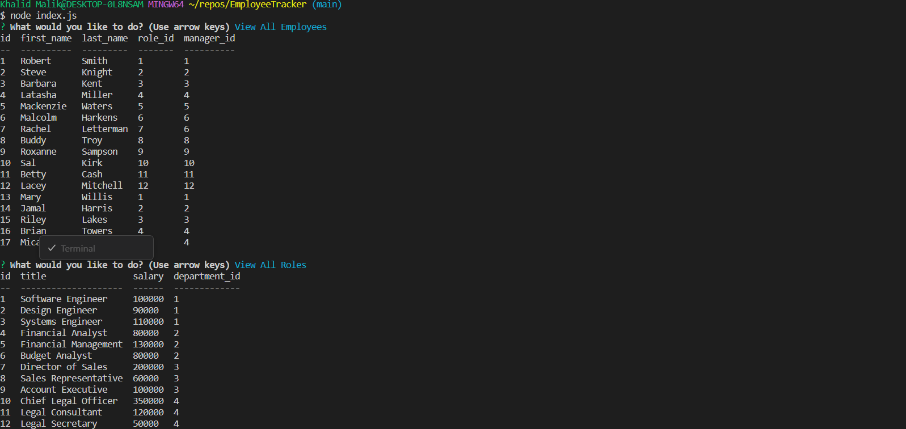
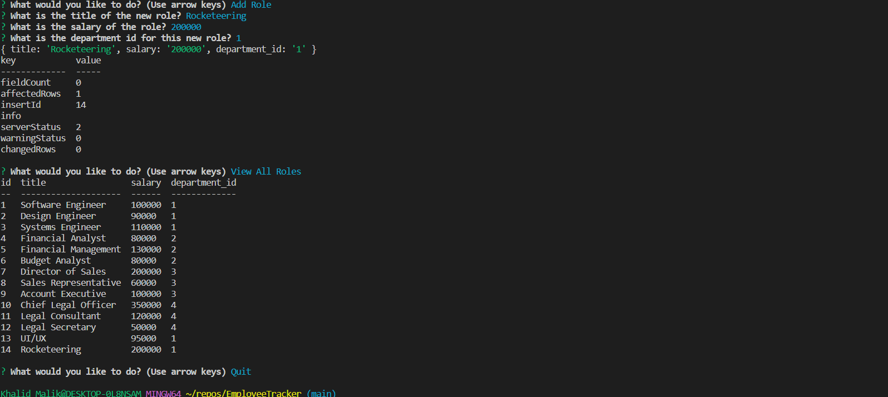

# Employee Tracker - SQL

## My Task

Interfaces are such a commonly created tool that developers build for those who do not develop. This allows the non-developer to smoothly interact with and view stored information inside of databases. These interfaces are called **(CMS) Content Management Systems**. My assignment was to build from scratch a command-line application that can manage company's employee database. I have done this using Node.js, Inquirer, and MySQL.

I have installed the `Inquirer` package and it is up to date with the Inquirer 8.2.4 version.

Because this application won't be deployed, I have also recorded a walkthrough video that demonstrates the functionality required and showcases that with the following acceptance criteria being met.

## User Story

```
AS An owner of a striving business
I WANT to have access to viewable documentation of departments, roles, and employees in my company 
SO THAT I can manage, organize and plan business thoroughly 
```

## Acceptance Criteria

```
GIVEN a command-line application that asks for user input
WHEN I run the application
THEN I am prompted with the following: View All Employees, Add Employee, Update Employee Role, View All Roles, Add Role, View All Departments, Add Department, and Quit
WHEN I choose a "View All.." option from the list 
THEN I am presented with a clean chart that displays the nature and contents of that particular dataset
WHEN I choose a "Add.." option 
THEN I will be presented with a series of questions that includes id numbers, names, titles, and other relevant data to match the dataset I am looking to add too
WHEN I am finished with those additions
THEN those additions will be inserted into the datasets and will be viewable upon revisiting the "View All.." options 
WHEN I choose the "Update Employee" option
THEN I will be asked to provide first and last name of the employee as well as the role id and manager id in order to get them into the new role
WHEN I am done with the prompt I choose "Quit" to exit out of the prompt
```

## Mock-Up

The following video is an example given to me to demonstrate how the application is to be used from the command line:

[](https://2u-20.wistia.com/medias/2lnle7xnpk)

## Getting Started

This Challenge has required me to utilize the video submission method and I have referred to the [Fullstack Blog Video Submission Guide](https://coding-boot-camp.github.io/full-stack/computer-literacy/video-submission-guide) for guidance.

I have used [MySQL2 package](https://www.npmjs.com/package/mysql2) to connect to your MySQL database and performed queries, and the [Inquirer package](https://www.npmjs.com/package/inquirer/v/8.2.4) to interact with the user via the command line.

**Important**: Since I committed a file that contains my database credentials, I was cognizant of the information I displayed. No personal information or private details were used during the course of this assignment.

My database schema was designed based upon the following image:


As shown, my schema contains the following:

* `department`

    * `id`: `INT PRIMARY KEY`

    * `name`: `VARCHAR(30)` to hold department name

* `role`

    * `id`: `INT PRIMARY KEY`

    * `title`: `VARCHAR(30)` to hold role title

    * `salary`: `DECIMAL` to hold role salary

    * `department_id`: `INT` to hold reference to department role belongs to

* `employee`

    * `id`: `INT PRIMARY KEY`

    * `first_name`: `VARCHAR(30)` to hold employee first name

    * `last_name`: `VARCHAR(30)` to hold employee last name

    * `role_id`: `INT` to hold reference to employee role

    * `manager_id`: `INT` to hold reference to another employee that is the manager of the current employee (`null` if the employee has no manager)

    I have included separate files that perform functions for specific SQL queries used. This includes a `seeds.sql` file that pre-populates my database.

    ## Review

    This section is here to highlight the required elements needed for review:

    * My walkthrough video demonstrating the functionality of the application:

    Refer to this [Walkthrough Video](https://drive.google.com/file/d/1T-RyWl9JdJJnbQ53PikV4AbXhEEf5nE3/view) to view the functionality of this application
    

    * The URL to my EmployeeTracker GitHub repository, with an unique name and this README to describe the project:

    Refer to this link [GitHub Repository](https://github.com/TheKhalidGibson/EmployeeTracker) to view and explore the GitHub repo for this assignment

    ## Screenshots

    The following images reflect the functionality and final results of development for this command-line application:
    
    
    
    